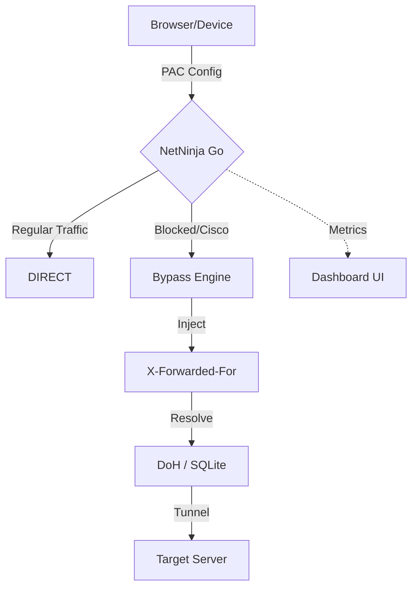

# NetNinja
A fast, simple proxy to bypass DNS filters and Cisco SSE intersections.

NetNinja is a lightweight forward proxy written in Go. I built it to solve a specific problem: bypassing annoying network-level blocks (like Cisco Secure Client or DNS filters) without the overhead of a full VPN.

It works on a **Direct-by-Default** principle. Normal traffic goes straight through at line speed. The proxy logic only kicks in when it detects a blocked domain or an intercepted Cisco link.

### What it does:
- **Live Terminal Dashboard**: A WebSocket-powered UI that updates every second with system health.
- **Nitro-Tier Performance**: All routing rules are cached in memory (O(1)) and persistence is handled asynchronously to ensure zero-latency in the main data path.
- **Active IP Tracking**: Shows you who's connected. Click an IP to check its details on ipinfo.io.
- **Header Injection**: Automatically adds `X-Forwarded-For` and `X-Real-IP` to HTTP traffic.
- **Cisco Unwrapper**: Detects and fixes those wrapped Cisco SSE domains and hex-encoded hostnames automatically.
- **DNS-over-HTTPS (DoH)**: If your local DNS is lying to you, it falls back to Cloudflare/Google DoH over port 443.
- **Persistent Cache**: Uses a local SQLite DB (non-blocking) to remember intercepted domains for future access.

### How it works:


### Technical Specs:
| Feature | Implementation |
|---------|----------------|
| **Engine** | Go (GOMAXPROCS tuned, 128KB buffers) |
| **I/O Strategy** | **Nitro Mode**: Async Database Writes & Background Logging |
| **Cache** | In-Memory Rule-Fast-Path + Pure Go SQLite |
| **Tracking** | Concurrent-safe sync.Map with IP normalization |
| **Updates** | 1Hz Low-overhead WebSocket streaming |

### Getting Started:
1. **Build** the binary:
   ```powershell
   ./build.ps1
   ```
2. **Run** it:
   ```bash
   ./proxy.exe
   ```
3. **Setup**: Point your system/browser's PAC (Proxy Auto-Config) URL to:
   ```
   http://YOUR_SERVER_IP:8080/proxy.pac
   ```

### API:
- `/` : Live dashboard
- `/proxy.pac` : Auto-generated config
- `/logs` : Raw log view from SQLite
- `/ws` : Metrics stream

### License:
MIT License - see the [LICENSE](LICENSE) file for details.

---
Developed by **Watcharapong Namsaeng** — [@KongGithubDev](https://github.com/KongGithubDev)
