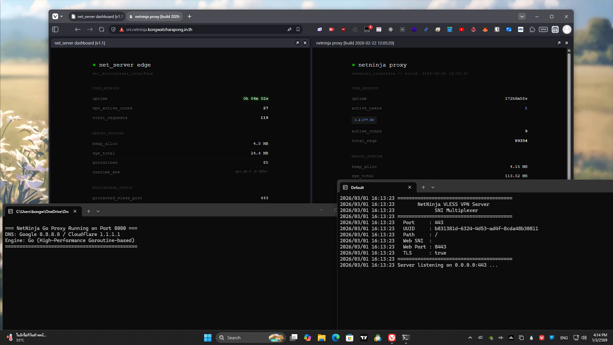

# NetNinja

**NetNinja** is a lightweight, multipurpose networking toolkit written in Go. It is built specifically to deploy fast forward proxies and bypass firewalls using WebSocket (VLESS) tunnels. It is designed to be fast, minimal, and resource-efficient.



## Core Tools

1. **`net_server.go` (VLESS VPN + SNI Multiplexer)**
   This component serves as a VLESS server featuring a built-in **SNI Multiplexer**. This capability allows the server to listen on port `443` while seamlessly sharing the same port with an existing web server (such as Nginx or Caddy). It operates by interrogating incoming TLS ClientHello packets:
   - For standard website traffic, it proxies the raw connection directly to the upstream web server, preserving the original SSL sequence.
   - For incoming VPN traffic utilizing an **SNI Bug** (e.g., `line.me`), it dynamically generates a temporary in-memory certificate, terminates the TLS connection, and transitions into an active VLESS VPN session.
   - **Important Note:** Because `net_server` relies on intercepting SNI handshakes, it **requires port 443**.

2. **`proxy.go` (NetNinja HTTP/HTTPS Proxy)**
   A straightforward Forward Proxy suitable for routing local traffic or deploying domain-based filtering. It includes a low-overhead dashboard for monitoring status, accessible at `http://127.0.0.1:8080/`.

---

## Installation & Usage

### 1. The VPN Edge Server (`net_server.go`)

This service is intended to act as the exit node on a VPS. It can be built directly from the source code:

```bash
go build -o net_server.exe net_server.go
```

To execute the service, use the provided batch script (`run-netserver.bat`) or run the executable directly.

To share port `443` with an existing website (placing `net_server` in front), execute it with the following parameters:
```bash
./net_server.exe -port 443 -tls true -web-port 8443 -web-sni your-domain.com
```
Ensure that the upstream web server (Nginx/Caddy) is configured to listen on an internal port such as `8443` instead of `443`. `net_server` will govern port `443`; traffic matching `your-domain.com` will be forwarded to port `8443`. Unrecognized domains will be processed as VPN traffic.

**Client Application Setup:**
Copy the following URI and import it into a compatible client (e.g., V2Ray, v2box, Shadowrocket). 
*(Ensure that `allowInsecure: true` or "Skip Cert Verify" is enabled in the client application, as the connection utilizes dynamically generated certificates.)*
```text
vless://[UUID]@[SERVER_IP]:443?encryption=none&security=none&type=ws&host=[YOUR_SNI_BUG]&path=%2F#NetNinjaTunnel
```

### 2. The Traffic Filter (`proxy.go`)

This tool is useful for testing traffic filtering or establishing a local network proxy.

```bash
go build -o proxy.exe proxy.go
```

Execute the binary:
```bash
proxy.exe
```

### 3. PC Client Setup (v2rayN / Windows)

For Windows users who want to use the VPN tunnel directly on their PC (bypassing the need to tether from a mobile device or router), you can use **v2rayN**.

1. Download **v2rayN-Core.zip** from the [v2rayN GitHub Releases](https://github.com/2dust/v2rayN/releases).
2. Extract the ZIP file and run `v2rayN.exe`.
3. Copy your `vless://...` URI.
4. In v2rayN, press `Ctrl+V` or go to **Servers** > **Import from Clipboard**.
5. Double-click the imported server to verify settings. Ensure that:
   - **Network (Transport):** `ws`
   - **Path:** `/`
   - **TLS:** `tls`
   - **SNI:** *[Your SNI Bug domain, e.g., line.me]*
   - **AllowInsecure:** `true` (Crucial! because net_server uses self-signed certificates)
6. Click **Confirm**. Right-click the server in the list and select **Set as active server**.
7. Right-click the v2rayN icon in the system tray (bottom right of your screen), go to **System Proxy**, and select **Set system proxy**.

---

*Disclaimer: This project was built strictly for educational purposes, learning how to manipulate network packets, and studying firewall evasion techniques. The developers are not responsible for any misuse or policy violations if deployed on unauthorized networks.*
