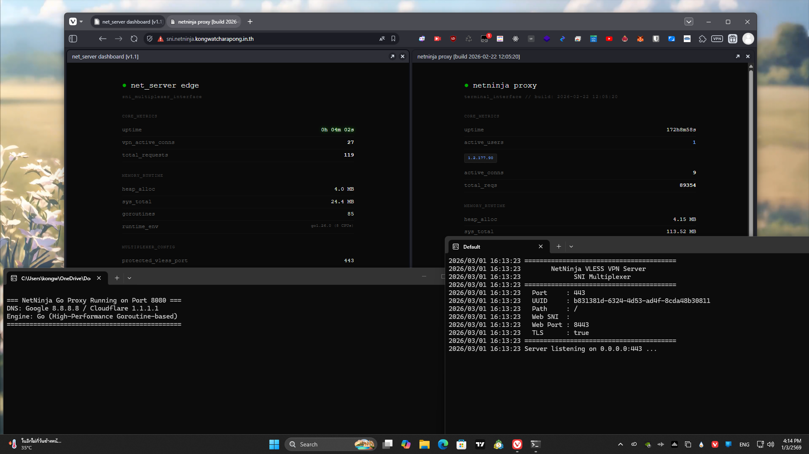

# NetNinja

NetNinja is a lightweight, high-performance networking toolkit written in Go. Its active component is an HTTP/HTTPS forward proxy with Cisco Umbrella bypass, DNS caching, quotas, ad-blocking, and Cloudflare-protected-site auto-hop egress. It also bundles a retired VLESS VPN/SNI-multiplexing tunnel stack under `legacy/`.



## Components

### net_server (VLESS VPN + SNI Multiplexer) — LEGACY

> **Retired.** Code moved to `legacy/` and excluded from the root `go build`. Retained for reference
> and historical test vectors (`.npvt` payloads). See `legacy/` directory.

A VLESS server with built-in SNI multiplexer that listens on a single TCP/UDP port (default 443) and transparently shares it with an existing web server. It inspects incoming TLS ClientHello packets to route traffic:

- Recognized SNI domains are proxied to the upstream web server (e.g. Nginx on port 8443) preserving the original TLS handshake.
- Unrecognized traffic (e.g. VPN clients using an SNI bug) triggers a dynamically generated in-memory certificate, TLS termination, and VLESS VPN session.
- QUIC/HTTP3 UDP NAT relay runs on the same port for low-latency streaming.

**Features:**
- Real SSL support via `-cert` / `-key` flags or auto-generated self-signed certificates
- ALPN stealth advertising h2 and http/1.1
- Concurrent-safe WebSocket with mutex-protected writes
- WebSocket Ping/Pong heartbeat for unstable mobile networks
- Dual-mode buffer pools: 512KB for TCP streaming, 4KB for UDP
- TCP socket tuning: SetNoDelay, KeepAlive, 512KB socket buffers
- sync.Pool buffer reuse for minimal GC pressure
- Real-time dashboard with bandwidth chart, CDN monitoring, and connection tracking
- PAC auto-config server for browser proxy configuration
- Profile-Guided Optimization (PGO) support

### proxy (HTTP/HTTPS Forward Proxy)

A forward proxy that bypasses Cisco Umbrella content filters (DNS-level blocking). It resolves DNS and originates connections from the proxy's own IP, which sits outside the filtering policy. Includes an HTTP(S) CONNECT tunnel, a PAC auto-config server, and a block-check endpoint.

**Features:**
- HTTP Basic Auth via `PROXY_USERS="user:pass,user2:pass2"` (default `Kong:KongPassword`); additional users managed live via the admin console. Disable with `PROXY_AUTH_ENABLED=0` — when auth is off, the admin dashboard tracks connections by client IP instead of username
- CONNECT tunneling over Go's high-performance goroutine engine
- Dual DNS resolution (standard + DoH) for bypassing filtered resolvers
- SQLite-backed persistent DNS cache and domain rule store (WAL mode, busy-timeout hardened)
- Per-user **bandwidth quota** (bytes-down) and **account suspension** — enforced at CONNECT/HTTP with a 403 and logged to the audit trail
- **Ad-blocking**: CONNECT/HTTP tunnels to known ad/tracking networks are refused with 403 (suffix + exact host lists, block counter on the dashboard)
- Real-time dashboard with active users, live traffic, bytes up/down, DNS hits, top hosts, and a bandwidth sparkline
- **Admin console** at `/admin` (BASIC auth, separate credentials): user management, per-user usage drill-down, full connection audit trail, and admin action log
- PAC auto-config file served at `/proxy.pac`
- `/block-check?url=<url>` endpoint: fetches a target through the proxy and reports whether it is reachable from outside the filter (NOT BLOCKED / TIMEOUT)

**PAC routing (current):**
- Default: `PROXY <PROXY_ADDR>; DIRECT` — all traffic tries the proxy first (Cisco block pages return HTTP 200, so the DIRECT fallback never triggers on filtered sites)
- Direct exceptions (bypass proxy to keep video/QUIC and Apple services fast): `googlevideo.com` (YouTube video), `apple.com`, `icloud.com`, `apple-cloudkit.com`, `mzstatic.com`, `itunes.com`, plus LAN/loopback addresses
- YouTube UI/API/comment hosts (`youtube.com`, `ytimg.com`, `yt3.ggpht.com`, `googleapis.com`, `google.com`, `gstatic.com`, `ggpht.com`, `googleusercontent.com`) route through the proxy so their DNS resolves at the proxy IP — this restores YouTube Restricted-Mode-gated content (e.g. hidden comments) that the on-device Umbrella profile forces via DNS

**Admin console (`/admin` with `ADMIN_USER` / `ADMIN_PASS`):**
- `/admin` — all users: bytes up/down, connection count, first/last seen, live indicator, devices (client IP + UA), plus add/delete user, set quota (GB), suspend/unsuspend
- `/admin/user?name=<user>` — drill-down: per-host traffic summary and the last 100 activities
- `/admin/logs` — full connection audit trail (status flows: `ok`, `http`, `dial_fail`, `ad_block`, `proxy_off`, `suspended`, `quota`) with user/host/status filters and pagination
- `/admin/audit` — every admin action (add/delete/quota/suspend/settings) with timestamps

**User settings (`/settings` — BASIC auth with your own proxy account, run `curl -u user:pass` or open in a browser):**

Each account can decide to stop using the proxy (devices then connect to the internet **directly**, unsurprisingly through the PAC's `; DIRECT` fallback) and/or disable ad-blocking for themselves. Toggles apply immediately and persist in SQLite. Admins also get global switches + per-user flags at `/admin`.
- Per-user: `/settings` — "สลับ → ปิด (ต่อตรง)" / "สลับ → ปิด ads block", plus "reset inherit" to go back to following the global switch
- Global (all users): `/admin` → "global settings" → "ปิด proxy (ให้ทุกคนต่อตรง)" / "ปิด ads block (ปล่อยโฆษณาผ่าน)"
- A refused proxy gives HTTP 403 + audit status `proxy_off` (account policy), so the device falls back to the PAC's `; DIRECT` route

**Proxy environment variables:**

| Variable | Default | Description |
|----------|---------|-------------|
| PROXY_USERS | Kong:KongPassword | Comma-separated `user:pass` auth pairs |
| PROXY_AUTH_ENABLED | 1 (on) | Set `0` or `false` to disable proxy authentication — anyone can use the proxy without credentials. Admin dashboard tracks connections by client IP instead of username |
| ADMIN_USER | admin | Admin console BASIC-auth user |
| ADMIN_PASS | (required) | Admin console password |
| PORT | 8080 | Listen port |
| PROXY_ADDR | request Host | Proxy address embedded in the PAC / welcome flows |
| LOG_RETENTION_DAYS | 30 | How long `conn_logs` rows are kept (admin_logs kept 90 days, per-user totals forever) |
| TUNNEL_IDLE_SECONDS | 180 | Reap established CONNECT tunnels that have had NO traffic (both directions) this long — clean FIN before mobile NATs/Azure SLB can silently drop them; active streams (video) are never touched |
| PROXY_DEBUG | (off) | Verbose per-tunnel idle-watchdog logging |
| ADBLOCK_URL | (off) | Fetch an external blocklist (adblock / hosts / dnsmasq / plain-domain) on boot then refresh every ADBLOCK_REFRESH_HOURS — e.g. HaGeZi `https://raw.githubusercontent.com/hagezi/dns-blocklists/main/adblock/multi.txt` (~190k domains) |
| ADBLOCK_PATH | (off) | Local blocklist file — loaded once at boot; takes precedence over ADBLOCK_URL |
| ADBLOCK_REFRESH_HOURS | 24 | How often to re-fetch ADBLOCK_URL |
| PAC_DIRECT_DOMAINS | (none) | Comma-separated domains served `DIRECT` in /proxy.pac — the device skips the proxy for those hosts (useful when a site's Cloudflare blocks the datacenter/proxy IP, e.g. `animeruka.com`) |
| HOP_DOMAINS | (none) | Comma-separated domains whose TCP connections are dialed out through a SOCKS5 server (`HOP_SOCKS5`, no-auth) instead of the proxy's own IP. DNS is still resolved at the proxy (bypasses Cisco), only the connection leaves from the hop's IP — for Cloudflare zones that block the Azure datacenter IP or geo-lock to Thailand |
| HOP_AUTODETECT | 1 (on) | Auto-detect: any hostname that Cloudflare answers **403 / "Just a moment"** when tunnelled from the proxy's own IP is probed once on first use and then routed through `HOP_SOCKS5` automatically — no per-domain config needed. Detected hosts persist in SQLite (`hop_auto`) and are re-probed at most daily; set `0` to disable. If the hop is unreachable the proxy degrades to direct instead of failing |

Without ADBLOCK_URL/PATH the proxy uses a small built-in list. Aggressive base ad-network domains (`*.doubleclick.net`, `*.googlesyndication.com`, …) are always merged into whatever list is loaded. Blocking walks the hostname + every parent label (a blocked domain covers its subdomains) with an `@@` allowlist honored first. Reload anytime at `/admin` → "โหลด blocklist ใหม่".

**SQLite stores** (`proxy_cache.db`, WAL mode): `proxy_users`, `user_settings` (quota + suspension), `user_hosts` (per-user per-host totals, flushed every 5s and reloaded on boot), `conn_logs` (append-only audit), `admin_logs`, `domain_rules`, `dns_records`, `hop_auto` (auto-detected Cloudflare-blocked hosts).

---

## Performance Optimizations

### DNS Resolver Chain

1. In-memory cache with video CDN-aware TTL (30s for googlevideo.com, youtube.com, etc.)
2. Standard DNS via Google/Cloudflare resolvers (8.8.8.8, 1.1.1.1)
3. DNS over HTTPS (Cloudflare + Google) as fallback
4. IPv6 (AAAA record) support with automatic IPv4 preference

### QUIC/HTTP3 UDP NAT Relay

UDP NAT relay on the same port as the TCP listener, enabling QUIC/HTTP3 traffic passthrough:
- NAT mapping keyed by client IP:port
- Automatic stale entry cleanup after 5 minutes (check every 2 minutes)
- Race-condition-safe entry creation with isWinner pattern
- 64KB buffer pool for large UDP datagrams

### Garbage Collection Tuning

| Variable | Default | Description |
|----------|---------|-------------|
| NET_GOGC | 200 | Go GC percentage (higher = less frequent GC) |
| NET_MEMLIMIT | 536870912 (512MB) | Soft memory limit to prevent OOM |

### Profile-Guided Optimization

PGO improves throughput by 2-7% on CPU-bound workloads. The `default.pgo` profile file is auto-detected by `go build`. Regenerate with:

```powershell
go build -o profiling-load-gen.exe profiling-load-gen.go
./profiling-load-gen.exe
go build -pgo=default.pgo -o net_server.exe net_server.go
```

---

## Installation

### Prerequisites

- Go 1.25 or later

### Build

```powershell
# Build the proxy (main component)
go build -o dist\proxy.exe .

# Linux build (Azure VM deployment)
go build -o dist\proxy_linux .
```

---

## Usage

### 1. VPN Edge Server (net_server) — LEGACY

Runs on a VPS as the tunnel exit node.

```powershell
# With real SSL certificate (recommended)
net_server.exe -port 443 -cert fullchain.pem -key privkey.pem -web-port 8443 -web-sni example.com

# With self-signed certificate
net_server.exe -port 443 -tls true

# Without TLS (for testing)
net_server.exe -port 8444 -tls false
```

#### Command-Line Flags

| Flag | Default | Description |
|------|---------|-------------|
| -port | 443 | Listen port |
| -uuid | b831381d-6324-4d53-ad4f-8cda48b30811 | VLESS UUID |
| -path | / | WebSocket path for VLESS |
| -tls | true | Enable internal TLS termination |
| -cert | | Path to SSL certificate (PEM) |
| -key | | Path to SSL private key (PEM) |
| -web-sni | | Comma-separated SNI domains to forward to web server |
| -webport | 8443 | Local web server port |
| -pac | /proxy.pac | PAC file path |
| -proxy-addr | | Override proxy address in PAC |
| -udp-port | *auto | UDP port for QUIC/HTTP3 relay (*auto = same as -port) |

#### Environment Variables

NET_PORT, NET_UUID, NET_PATH, NET_TLS, NET_CERT, NET_KEY, NET_WEB_SNI, NET_WEB_PORT, NET_PROXY_ADDR, NET_GOGC, NET_MEMLIMIT

#### Dashboard

Access the real-time control center at `https://[SERVER_IP]:443/`:
- Real-time bandwidth chart (5-minute history)
- Active VPN connections and total requests
- Throughput upload/download in bps
- Video CDN node detection and access counts
- Active destination tracking
- UDP relay count for QUIC/HTTP3
- PAC auto-config URL (click to copy)

#### Client Configuration

```text
vless://[UUID]@[SERVER_IP]:443?encryption=none&security=none&type=ws&host=[SNI_BUG_DOMAIN]&path=%2F#NetNinja
```

Note: Allow insecure certificates (AllowInsecure: true) in the client for self-signed certificate scenarios.

### 2. Traffic Filter (proxy)

A forward proxy for routing local traffic with Cisco Umbrella detection.

```powershell
# Default port 8080
proxy.exe

# Custom port
set PORT=5988 && proxy.exe

# Proxy address used in the PAC file (defaults to request Host)
set PROXY_ADDR=proxy.example.com:443

# Admin console credentials
set ADMIN_USER=admin && set ADMIN_PASS=changeme
```

Dashboard at `http://127.0.0.1:[PORT]/`. PAC file at `/proxy.pac`.
Block check: `http://127.0.0.1:[PORT]/block-check?url=https://example.com/`.
Admin console: `http://127.0.0.1:[PORT]/admin` (use `ADMIN_USER`/`ADMIN_PASS`).

---

## Deployment

```powershell
# One-command deployment (TCP tuning, build, firewall, service install)
.\deploy.ps1

# Dry run to preview changes
.\deploy.ps1 -DryRun

# Deploy with NSSM Windows service
.\install-service.ps1 -Action install

# Configure firewall rules
.\configure-firewall.ps1 -Action apply

# Full deployment checklist: see DEPLOYMENT.md
```

---

## Load Testing

```powershell
# Run all benchmarks (10s per test)
.\run-loadtest.ps1

# Extended test for stable results
.\run-loadtest.ps1 -Duration 30

# Run load-tester directly
load-tester.exe -proxy 127.0.0.1:8444 -direct 127.0.0.1:8444 -duration 10
```

Benchmarks measure: HTTP proxy throughput (1/10/50 concurrency), CONNECT tunnels (5/25), large file transfer bandwidth, PAC/dashboard response time, and P50/P90/P99 latency percentiles.

---

## Project Structure

```
NetNinja/
├── proxy.go               # Main binary: HTTP/HTTPS Forward Proxy (PAC, admin console,
│                          #   DNS cache, quotas, ad-block, Cloudflare auto-hop egress)
├── ansi_other.go          # ANSI color helpers (non-Windows)
├── ansi_windows.go        # ANSI color helpers (Windows)
├── go.mod / go.sum        # Go module (module netninja-proxy)
├── Dockerfile             # Container build (Fly.io / generic)
├── fly.toml               # Fly.io deployment config
├── README.md
├── LICENSE
├── dist/                  # Prebuilt Linux binaries (gitignored, build via go build)
└── legacy/                # Retired NPVT tunnel stack (kept for reference)
    ├── NPVTUNNEL.py       #   Old protocol client (base64/gzip/pickle payloads)
    ├── npvt_encoder.py    #   Payload encoder
    ├── npvt_modify.py     #   Payload modifier
    ├── npvt_tool.py       #   Payload inspection tool
    ├── net_server.go      #   Old VLESS VPN + SNI multiplexer
    ├── ws-tunnel.go       #   WebSocket tunnel helper
    ├── npvt/              #   Test/sample .npvt payload vectors
    ├── run.sh             #   Old bore-tunnel run script
    ├── run-*.bat          #   Old Windows launchers
    ├── admin.html         #   Old admin console snapshot
    └── d.html             #   Old dashboard snapshot
```

### Building

The root contains only `proxy.go` (package main), so a plain `go build` works:

```bash
# Linux (deployed to Azure VM)
go build -o dist/proxy_linux .

# Windows
go build -o dist/proxy_linux.exe .

# Docker
docker build -t netninja-proxy .
```

The `legacy/` Go files (`net_server.go`, `ws-tunnel.go`) are not part of the root module build
and must be compiled individually if ever needed, e.g. `go build -o ws-tunnel legacy/ws-tunnel.go`.

---

## Architecture

### Port Sharing

net_server uses an in-memory listener pattern. The main TCP listener accepts all connections on port 443, then:

1. Reads the first 5 bytes to detect TLS ClientHello or plain HTTP.
2. Extracts the SNI from TLS handshakes.
3. Routes recognized SNIs to the upstream web server via a new TCP connection.
4. Upgrades unrecognized TLS connections to HTTP for VLESS WebSocket handling.
5. Plain HTTP requests are handled directly or forwarded through the built-in proxy.

### DNS Resolution

Multi-layered approach: in-memory cache (with video CDN-aware TTL) -> standard DNS via Google/Cloudflare -> DNS over HTTPS fallback -> IPv6 support with automatic fallback. Detects and unwraps Cisco Umbrella SSE-wrapped domain names.

---

## Disclaimer

This project is built for educational purposes, including network packet analysis and firewall evasion research. The developers are not responsible for any misuse or policy violations if deployed on unauthorized networks.
